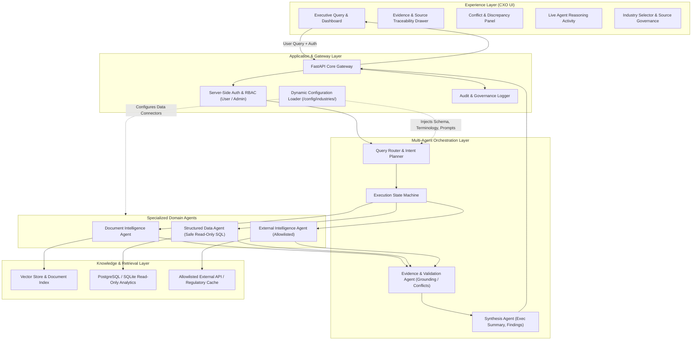

# Nebula9 Enterprise Knowledge Intelligence Reference Platform

[](#)
[](#)
[](#)

> **Reusable, industry-configurable demonstration platform for enterprise knowledge discovery, multi-agent reasoning, evidence validation, and governed AI answers.**

---

## 1. Core Proposition
Enterprises suffer from fragmented knowledge across disconnected operational silos: unstructured documents (SOPs, OEM manuals, incident memos), structured databases (ERP, MES, maintenance tickets), and controlled external sources (supplier bulletins, regulatory updates).

**Nebula9 Enterprise Knowledge Intelligence** demonstrates how an enterprise can ask a single strategic business question across these disconnected sources, have specialized AI agents retrieve and reason over the appropriate data, validate evidence and conflicts, and return an executive-first answer with visible citations and data provenance.

---

## 2. Platform Architecture



---

## 3. Configuration vs. Code Boundary
The platform is designed to be **100% industry-agnostic**. Any core-code change required solely to switch industries is strictly flagged as an architectural violation.

```
config/
└── industries/
    ├── manufacturing/
    │   ├── industry.yaml           # Industry metadata and UI labels
    │   ├── terminology.yaml        # Synonyms & business glossary (OEE, MTBF, etc.)
    │   ├── sources.yaml            # Registered docs, DB schemas, external APIs
    │   ├── prompts.yaml            # Domain system prompts and synthesis guidance
    │   ├── scenarios.yaml          # Curated CXO demo questions & narratives
    │   └── evaluation.yaml         # 25 benchmark QA pairs for quality evaluation
    └── retail_cpg/                 # Second industry validation pack (Zero-code proof)
        ├── industry.yaml
        ├── terminology.yaml
        ├── sources.yaml
        ├── prompts.yaml
        ├── scenarios.yaml
        └── evaluation.yaml
```

---

## 4. 10-Week Roadmap Overview

| Week | Phase | Objective | Output |
| :---: | :--- | :--- | :--- |
| **Week 1** | **Architecture & Planning** | Define reusable platform before coding | Approved architecture, specs, storyboard, gap assessment |
| **Week 2** | **Platform Foundation** | Create application foundation | Running modular shell, API gateway, auth, config loader |
| **Week 3** | **Document Intelligence** | Make enterprise documents searchable & traceable | Chunking/indexing, document agent, page/section citations |
| **Week 4** | **Structured Data Intelligence**| Add structured enterprise data reasoning | PostgreSQL/SQLite datasets, safe read-only SQL agent, provenance |
| **Week 5** | **Multi-Agent Orchestration** | Connect specialized agents into one workflow | Query router, agent dispatch, synthesis agent, live trace |
| **Week 6** | **Evidence & Trust** | Make answers evidence-backed & safe | Grounding checks, citation binding, conflict detection |
| **Week 7** | **Enterprise Controls** | Add enterprise security & governance controls | RBAC, source isolation, audit logging, prompt injection tests |
| **Week 8** | **Manufacturing Industry Pack**| Turn platform into realistic manufacturing demo | Complete datasets (production, downtime, SOPs, supplier reports) |
| **Week 9** | **Evaluation & Hardening** | Prove quality and stabilize the system | 20–30 evaluation questions, latency checks, regression suite |
| **Week 10**| **Demo & Sales Packaging** | Deliver polished CXO-ready demo | 3–5 min demo flow, video, runbook, Retail & CPG validation |

---

## 5. Documentation Directory
- [System Architecture](docs/architecture/system_architecture.md)
- [Agent Responsibilities & Boundaries](docs/architecture/agent_boundaries.md)
- [Data Flow Specification](docs/architecture/data_flow.md)
- [Configuration vs Code Mapping](docs/architecture/config_vs_code.md)
- [Security Threat Model & Governance](docs/security/threat_model_and_governance.md)
- [Manufacturing Use-Case & Dataset Plan](docs/scenarios/manufacturing_use_case.md)
- [CXO Demo Storyboard](docs/scenarios/cxo_demo_storyboard.md)
- [Production vs Demo Gap Assessment](docs/gap_assessment.md)
