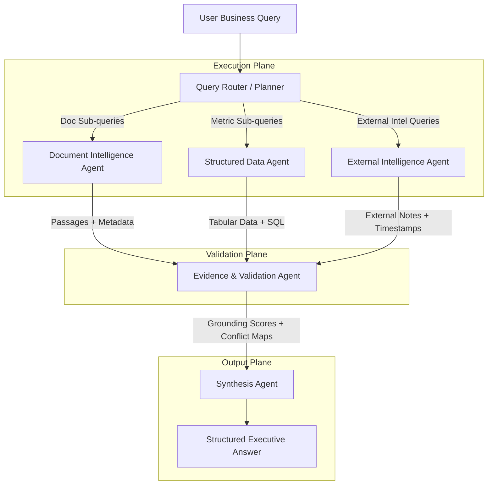

# Agent Responsibilities & Tool Boundaries

## 1. Principles of Agent Isolation
In the **Nebula9 Enterprise Knowledge Intelligence Reference Platform**, agents are specialized workers operating under the principle of **least privilege**. No single agent has universal access to all tools or raw data stores.

---

## 2. Detailed Agent Specifications

### 2.1 Query Router / Planner
- **Objective**: Parse intent, identify necessary information types, and formulate an efficient multi-agent execution plan.
- **Inputs**: User query string, user session role, registered industry configuration dictionary.
- **Outputs**: Directed execution plan `ExecutionPlan(agents=[...], sub_tasks=[...])`.
- **Allowed Tools**:
  - `inspect_terminology(term: str)`: Lookup business definitions and acronyms.
  - `inspect_sources_catalog()`: Check registered tables, documents, and date ranges.
- **Hard Boundaries**:
  - Cannot query databases or vector indexes directly.
  - Must not formulate answers to the user's question.

### 2.2 Document Intelligence Agent
- **Objective**: Search, filter, and extract relevant operational passages from unstructured document collections (SOPs, OEM manuals, incident memos).
- **Inputs**: Extracted document search queries, metadata filters (e.g., `doc_type='incident_report'`, `plant='A'`).
- **Outputs**: Ranked passages with rich metadata `List[DocumentPassage(text, doc_name, page, section, date)]`.
- **Allowed Tools**:
  - `hybrid_search_documents(query: str, filters: dict, top_k: int)`
  - `get_document_section(doc_id: str, section_header: str)`
- **Hard Boundaries**:
  - Read-only access to vector index and document store.
  - Prohibited from executing SQL queries or calling external web APIs.
  - Treats retrieved document text as untrusted data (wrapped in strict data tags).

### 2.3 Structured Data Agent
- **Objective**: Transform analytical business questions into safe, read-only SQL queries against structured databases and compute verified metrics.
- **Inputs**: Analytical metric query, target table/view context.
- **Outputs**: Aggregated tabular results, execution metadata, and full provenance `DataResult(rows, columns, sql_executed, execution_time_ms)`.
- **Allowed Tools**:
  - `describe_table_schema(table_name: str)`
  - `execute_readonly_sql(query: str)`
- **Hard Boundaries**:
  - All SQL queries pass through an AST validator (`sqlglot`); non-`SELECT` statements are blocked.
  - Database connection pool configured with a read-only database user.
  - Hard limit on returned row counts (`LIMIT 100` enforced automatically).

### 2.4 External Intelligence Agent
- **Objective**: Fetch verified external contextual data (e.g., OEM vendor advisories, industry benchmarks, market commodities).
- **Inputs**: Vendor name, component model, or regulatory standard ID.
- **Outputs**: `ExternalIntel(source_name, title, publication_date, excerpt, verification_status)`.
- **Allowed Tools**:
  - `fetch_allowlisted_advisory(source_id: str, topic: str)`
- **Hard Boundaries**:
  - Restricted to pre-approved domain allowlists.
  - Cannot browse arbitrary external URLs or download unvetted binary files.

### 2.5 Evidence & Validation Agent
- **Objective**: Act as an adversarial truth-checker before results are presented to the executive.
- **Inputs**: Raw extracts from Document Agent, Data Agent, and External Agent, alongside proposed factual claims.
- **Outputs**: `ValidationReport(grounding_score: float, citations: List[Citation], conflicts: List[Conflict], is_sufficient: bool)`.
- **Allowed Tools**:
  - `verify_claim_support(claim: str, evidence_chunks: list)`
  - `detect_numerical_discrepancy(metric_a: float, metric_b: float, tolerance: float)`
  - `verify_citation_existence(doc_id: str, page: int)`
- **Hard Boundaries**:
  - Does not query data sources; works strictly on candidate evidence and claims.
  - Has veto power: can flag an answer as "Insufficient Evidence" or "Unresolved Conflict".

### 2.6 Synthesis Agent
- **Objective**: Combine verified findings into an executive-ready, highly readable response with clear citations, data tables, and explicit caveats.
- **Inputs**: Original query, validated evidence items, confirmed conflict reports, validation score.
- **Outputs**: Standard structured executive response:
  - *Executive Summary* (2–3 sentences)
  - *Key Findings & Operational Implications* (bulleted)
  - *Data & Metrics* (structured markdown table)
  - *Evidence & Citations* (explicit references to page and query)
  - *Discrepancies & Conflicts* (highlighted side-by-side)
- **Hard Boundaries**:
  - Cannot include ungrounded assertions.
  - Must mark facts vs inferences clearly.
