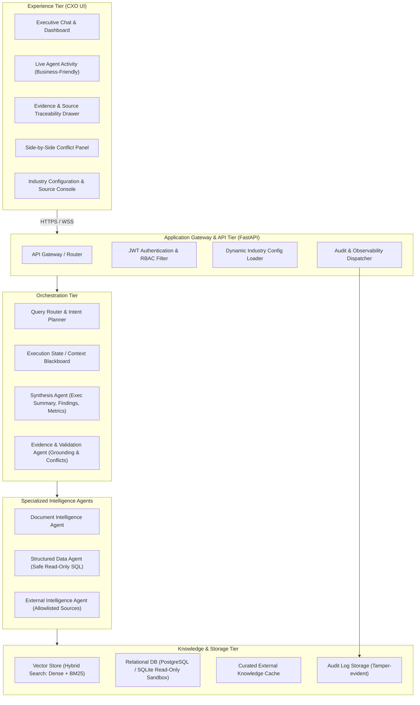

# System Architecture Specification

## 1. Overview
The **Nebula9 Enterprise Knowledge Intelligence Reference Platform** provides unified, evidence-first business intelligence across disparate enterprise silos. This document defines the components, protocols, and boundaries of the system.

## 2. Tiered System Architecture

## 3. Component Breakdown

### 3.1 Experience Layer (Frontend)
- **Framework**: React 18+ with TypeScript, styled with Tailwind CSS and Lucide icons.
- **Key Views**:
  1. *Executive Query Console*: Provides suggested CXO-level business questions, auto-suggest based on industry glossary, and intent preview.
  2. *Live Reasoning Tracker*: Translates technical agent/tool calls into executive language (e.g., "Scanning Q3 Maintenance Logs" instead of `SELECT * FROM mnt_logs WHERE plant='A'`).
  3. *Executive Answer Pane*: Structured layout displaying:
     - Executive Summary
     - Key Findings & Recommended Actions
     - Quantitative Data & Metrics Table
     - Grounding & Confidence Score
     - Evidence Citations (page/section links)
     - Discrepancy & Conflict Flags
  4. *Evidence Inspector*: Slide-out drawer revealing exact source passages, PDF page thumbnails, and SQL query provenance.
  5. *Industry Switcher*: Dropdown enabling instant zero-code switching between Manufacturing and Retail & CPG.

### 3.2 Application Layer (FastAPI Gateway)
- **Authentication**: JWT token validation supporting dual roles (`Executive/User` and `Auditor/Admin`).
- **Configuration Engine**: Watches `/config/industries/` and hot-reloads domain configurations without restarting the server.
- **Audit Logger**: Records full structured telemetry (user, query, agents executed, sources accessed, latency, grounding score).

### 3.3 Multi-Agent Orchestration Layer
- **Query Router / Planner**: Analyzes user question against registered schemas and domain dictionary to generate an execution plan. Avoids redundant agent calls.
- **Execution Blackboard**: Thread-safe shared state recording intermediate agent findings, retrieved chunks, and dataframes.
- **Evidence & Validation Agent**: Performs independent verification:
  - Validates that each synthesized claim is grounded in retrieved text.
  - Detects semantic or numerical contradictions across sources.
  - Quantifies evidence completeness and triggers refusal if insufficient.
- **Synthesis Agent**: Merges validated findings into the standard executive response format.

### 3.4 Knowledge & Data Layer
- **Document Store**: Hybrid search (BM25 keyword search + dense embeddings) with metadata filtering (tenant, plant, doc_type, date).
- **Structured Store**: Read-only connection to relational database; AST-level query validation ensures only `SELECT` statements are executed.
- **External Adapter**: Restricted client consuming pre-approved APIs or static regulatory snapshots.
