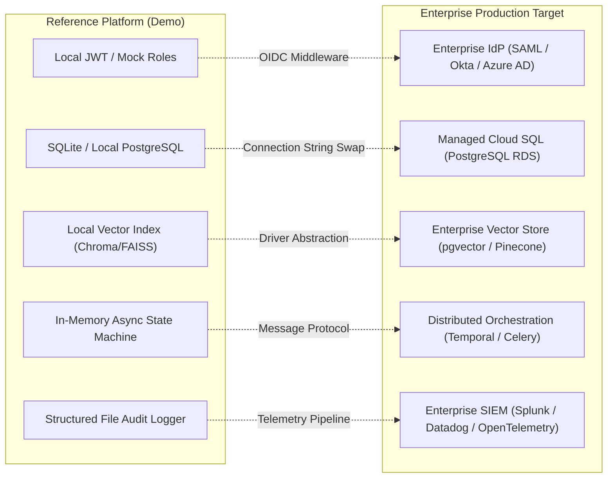

# Production Architecture vs. Demo-Only Gap Assessment

## 1. Executive Purpose
The objective of this reference implementation is to deliver a sales-ready, credible demonstration of Enterprise Knowledge Intelligence without overbuilding extraneous infrastructure. Every component must have a clean, demonstrable path to production.

This document transparently benchmarks the reference demo posture against enterprise production requirements.

---

## 2. Capability Gap Matrix

| Domain | Demo / Reference Implementation | Enterprise Production Target | Upgrade Path / Technical Transition |
| :--- | :--- | :--- | :--- |
| **Authentication & RBAC** | Local JWT tokens signed via HMAC-SHA256 with pre-configured mock roles (`Executive`, `Plant_Manager`, `Auditor`). | Enterprise Identity Provider integration (SAML 2.0, OpenID Connect via Okta, Ping, or Azure Active Directory). | The authentication layer is isolated behind a standard FastAPI dependency (`get_current_user`). Switching to OIDC requires only swapping the dependency provider to an OAuth2 bearer token validator. |
| **Relational Data Storage** | SQLite / Local PostgreSQL running with read-only sandbox user and schema reflection. | Clustered Managed PostgreSQL (AWS RDS / Cloud SQL) with read-replicas, row-level security (RLS), and connection pooling (PgBouncer). | Storage access uses an abstract SQL client (`SQLDatabaseService`). Switching targets requires modifying the database URI connection string in the environment file. |
| **Vector Indexing & Retrieval** | Embedded vector index (ChromaDB / FAISS) with local BM25 indexing for hybrid search. | Distributed pgvector, Qdrant, or Pinecone cluster with automatic sharding and hardware-accelerated HNSW indexing. | Document retrieval is abstracted behind `VectorStoreInterface` with uniform `similarity_search` and `hybrid_search` signatures. |
| **Multi-Agent Runtime** | Asynchronous Python state machine using `asyncio` blackboard in the FastAPI server process. | Distributed event-driven worker mesh orchestrated via Temporal.io, Celery, or Kafka event bus. | Agent interactions communicate via strictly typed Pydantic models (`AgentRequest`, `AgentResponse`), allowing extraction into independent microservices with zero protocol changes. |
| **Ingestion Pipeline** | Synchronous/batch local script executing PDF extraction, section chunking, and vector embedding generation. | Asynchronous distributed pipeline with OCR (Tesseract / Textract), table extraction (Camelot / Table Transformer), and dead-letter queues. | The ingestion logic exposes a standalone Python API (`ingest_document(file_path)`), enabling plug-and-play execution inside an Airflow DAG or AWS Lambda function. |
| **Audit & Governance** | Structured append-only JSONL / SQLite audit table with hash chaining and query metadata recording. | Enterprise SIEM pipeline (Splunk, Elastic, Datadog) and immutable write-once S3 Glacier storage for regulatory compliance. | The audit logger implements an event dispatcher interface (`AuditEventPublisher`), enabling simultaneous emission to local disk and an OpenTelemetry/Kafka collector. |
| **LLM Inference Gateway** | Direct HTTP client (Gemini 2.5 Flash / LiteLLM / OpenAI) with local caching. | Dedicated Enterprise LLM Gateway with dynamic fallback, token rate limiting, sensitive data masking (DLP), and private VPC endpoints. | All model calls route through `LLMGatewayInterface`, allowing dynamic model swapping or enterprise gateway routing via configuration. |
