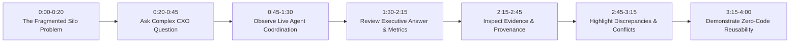

# CXO Demo Storyboard & Script

## 1. Demo Objectives & Constraints
- **Primary Audience**: Non-technical CXO prospects (COO, VP of Operations, CIO), Solution Architects, Nebula9 leadership.
- **Duration**: 3 to 5 minutes total.
- **Rule**: Must achieve comprehension within the first **60–90 seconds** without mentioning vector embeddings, chunking algorithms, or agent frameworks.

---

## 2. 60–90 Second Pitch Script (Opening Hook)

> **Presenter**:
> *"Good morning. When an enterprise experiences a critical operational failure—like a factory line stoppage—the answer to what went wrong is trapped in three separate worlds:*
> 1. *Your MES and ERP databases with timestamps and failure codes,*
> 2. *Your engineering SOPs and incident reports in PDF archives, and*
> 3. *Your vendor advisories and supplier quality alerts.*
>
> *Today, your engineering and operations teams spend days assembling spreadsheets to answer one executive question.*
> 
> *With Nebula9 Enterprise Knowledge Intelligence, you ask that question directly. Watch what happens: specialized, governed AI agents immediately pull the exact downtime hours from your database, cross-reference the engineering teardown memo, check the manufacturer manual, and give you an evidence-backed answer with verifiable citations and conflict detection in seconds."*

---

## 3. Minute-by-Minute Interactive Demo Walkthrough

### [0:00 – 0:20] Step 1: The Enterprise Reality
- **Screen**: Clean Executive Home Screen.
- **Action**: Presenter points to the dashboard showing connected knowledge silos: *Production Database (5,000 records)*, *Technical Manuals (24 documents)*, *Supplier Feeds (Active)*.

### [0:20 – 0:45] Step 2: The Executive Question
- **Action**: Click the suggested scenario:
  > *"What are the major factors contributing to production downtime at Plant A, and what actions have previously reduced similar downtime?"*
- **Callout**: Note that no single document or single SQL table has both the downtime numbers AND the previous engineering remediation procedures.

### [0:45 – 1:30] Step 3: Transparent Agent Activity (In Plain English)
- **Screen**: Agent Activity Feed lights up in real-time:
  - 🔍 *Query Router*: "Identified downtime metrics and historical remediation tasks."
  - 📊 *Structured Data Agent*: "Queried Plant A Q3 downtime events database (Found 14.2 hours on Line 2)."
  - 📄 *Document Agent*: "Retrieved SOP-MNT-402 (Section 4.2) and Q3 Engineering Memo."
  - 🛡️ *Validation Agent*: "Cross-verifying claims and checking for conflicting dates."

### [1:30 – 2:15] Step 4: The Executive Answer
- **Screen**: Answer renders into a structured executive layout:
  - **Executive Summary**: Clear 2-sentence synthesis.
  - **Key Findings**: Bulleted root causes.
  - **Metrics Table**: Line-by-line financial and hourly impact.
  - **Grounding Confidence**: 94% verified.

### [2:15 – 2:45] Step 5: Evidence & Source Traceability Drawer
- **Action**: Presenter clicks the citation badge `[SOP-MNT-402, Page 14]`.
- **Screen**: Evidence Drawer slides open on the right side.
- **Presenter**: *"Notice this claim about 68% downtime reduction: clicking the badge opens the exact paragraph in Section 4.2 of our hydraulic maintenance SOP. Next to it is the exact SQL query executed against our operational database. Nothing is a black box."*

### [2:45 – 3:15] Step 6: Conflict & Discrepancy Detection
- **Screen**: An amber alert badge is visible: **"1 Data Discrepancy Detected"**.
- **Action**: Presenter clicks the badge.
- **Presenter**: *"Here is where traditional chatbots fail and hallucinate. The operational database logged the shutdown as a 'Hydraulic Valve Seizure'. But the plant engineer's teardown memo filed two days later states the valve was clean and the fault was an upstream sensor timeout. Nebula9 does not guess or invent a fake consensus—it presents both records with timestamps so leadership can make an informed decision."*

### [3:15 – 4:00] Step 7: Proof of Reusability (Zero-Code Switch)
- **Screen**: Presenter opens the top-right Industry Selector and clicks **"Retail & CPG"**.
- **Screen**: UI reloads instantaneously with retail branding, retail glossary (SKUs, OOS, Sell-Through), and retail questions (e.g. *"Why did Product X underperform in Region A despite promotional spend?"*).
- **Presenter**: *"The core platform wasn't rebuilt or reprogrammed. We simply swapped the declarative configuration pack. The exact same agent orchestration, evidence validation, and governance engine powers both."*
